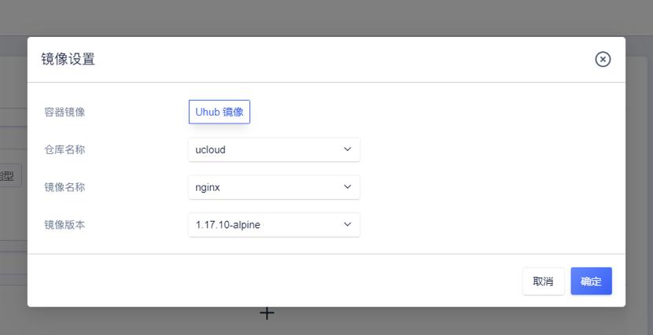
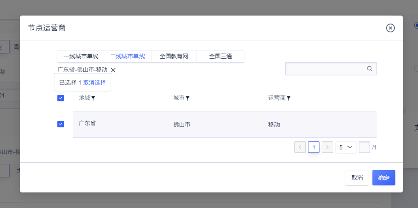
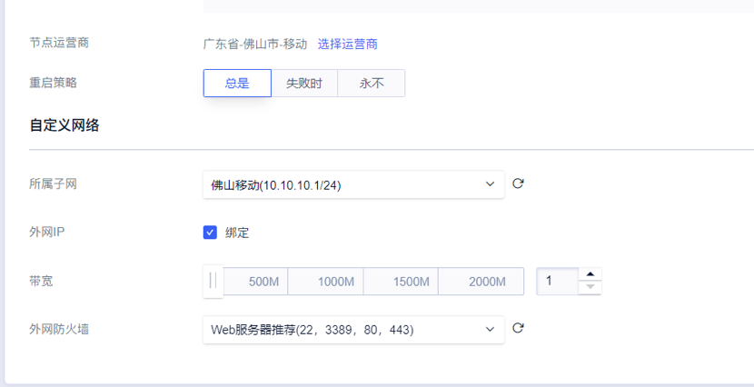

# 创建边缘容器

### 注意事项

1. 业务程序需已经完成容器化，已经具备业务镜像；

2. 容器组默认使用UCloud UHub镜像仓库，您需要创建并将镜像上传到镜像仓库；

3. 请预先在需要部署容器组的边缘运营商节点创建好子网；  

   

### 操作步骤

1.点击【创建容器组】进入创建页面，自定义容器组名称以及容器CPU、内存、镜像等信息；

    

   

2.点击【设置镜像】，选择您所需镜像，以使用**Uhub**镜像仓库中**nginx**镜像**1.17.10-alpine**版本为例；也可以使用自有镜像，详情参考：[UHub镜像仓库操作](https://docs.ucloud.cn/uhub/guide)   

  

3.选择【节点运营商】，按照规划边缘信息创建对应的容器组；  

  

4.配置网络，选择所属子网，为容器组分配内网IP，若需要公网访问，可勾选绑定外网IP、配置相关的带宽信息，并设置外网防火墙的相关策略。

    

5.点击确认购买后，完成创建操作，在边缘机房拉取镜像，启动容器组后，即可通过公网IP访问该容器组；  

